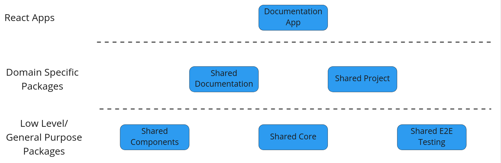

# LCA Collect - Shared Component Library

A shared library for universal components.
This library contains components that are/can be used by several upstream packages and apps.



## Getting Started

```shell
npm install
```

## Build, Test & Publish

Testing is done with [Vitest](https://vitest.dev/)

```shell
npm run test
```

To add a new component:

1. Add a folder containing the new component (remember to follow [naming conventions](#namingConventionHeader))
2. Add an export in the `src/components/index.ts`

To publish a new version:

1. Update the version in `package.json` (remember to follow semver)
2. When you're satisfied and ready to publish, then create a PR

## Development Setup with other @lcacollect packages

You can use `npm link` to set up live reloading of the other `@lcacollect` packages.

- Clone the package that you wish to enable live reload on.
- In the terminal, go the root folder of the cloned repo and write `npm link` in the terminal
- Go back to this repo's root folder and write `npm link @lcacollect/{PACKAGE}` to link the package.
- When you make changes to the package, that you wish to see in this app, simply run `npm run build` in the package and
  the changes will available here.

## <div id='namingConventionHeader'>Folder Structure and Naming</div>

```python
src/ # Contains the source code and components
    __mocks__/ # Contains the mock data and functions for unit tests
    components/ # React components
        myComponent/ # Each component has its own folder
            index.ts # Export of what is public
            myComponent.tsx # The component
            myComponent.spec.tsx # Unit test file
    dataAccess/ # Apollo Client folder
        generated.ts # Autogenerated file from Apollo with React Hooks for data fetching
        schema.graphql # File for writing GraphQL queries
```

## Further Documentation

Further documentation for LCAcollect can be found [here](https://github.com/lcacollect/.github/blob/main/wiki/README.md)
